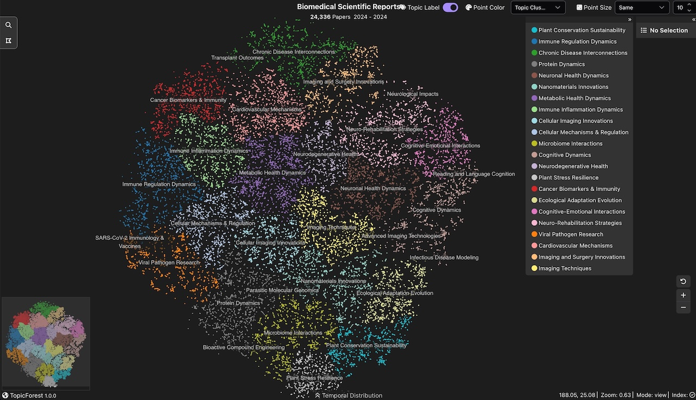

# TopicForest
TopicForest: Embedding-driven Hierarchical Clustering and Labeling for Biomedical Literature

## Interactive Hierarchical Clustering of Biomedical Articles from Scientific Reports

The interactive visualization of TopicForest's hierarchical clustering is available at https://clinicalnlp.org/topicforest/. 

## System Features
- The system displays 22 clusters, each assigned a unique color and an automatically generated topic label.
- Hover over a topic label to highlight all articles belonging to that cluster.
- Zoom in to explore more fine-grained subtopics within a selected cluster; zoom out to return to broader thematic groupings.
- Each point in the visualization represents a biomedical article. Hovering over a point will reveal the article’s title.

## Run the visualization system locally

If you cannot open the website or the website loads slowly, you can view the website locally by the following steps:

1. Download as a zip file (https://github.com/BIDS-Xu-Lab/topicforest/archive/refs/heads/main.zip) and unzip the file and go to the root folder topicforest-main.
2. Run the Python command to start a HTTP server: `python -m http.server`.
3. Open Google Chrome and navigate to http://localhost:8000/docs/, and it should show the same visualization system.