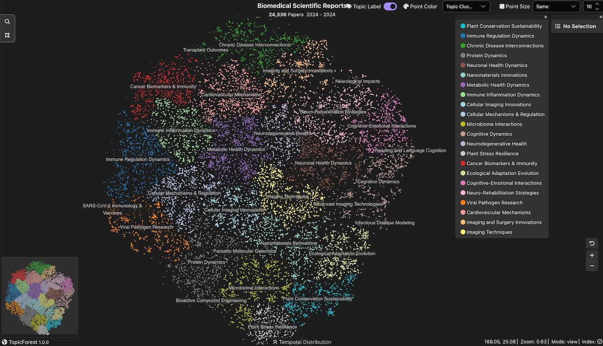

# TopicForest

This is an official implementation and demonstration of the paper:

Chang CH, Ondov B, Choi B, Peng X, He H, Xu H. TopicForest: embedding-driven hierarchical clustering and labeling for biomedical literature. J Biomed Inform. 2025 Nov 14;172:104958. doi: 10.1016/j.jbi.2025.104958. PMID: 41242669.

You can:
- [1 Interactive Demonstration of TopicForest](#1-interactive-demonstration-of-topicforest) if you are looking for online demonstration of TopicForest
- [2 Run TopicForest](#2-run-topicforest) if you are planning to use TopicForest on your dataset
- [3 Biological Abstracts from Scientific Reports](#3-biological-abstracts-from-scientific-reports) if you are interested in our collected biomedical abstracts from *Scientific Reports*

# 1 Interactive Demonstration of TopicForest

By applying TopicForest on 24K biomedical articles from *Scientific Reports*, we demonstrate its hierarchical clustering and topic labeling results in this interactive system: https://clinicalnlp.org/topicforest/.



## System Features
- The system displays 22 clusters, each assigned a unique color and an automatically generated topic label.
- Hover over a topic label to highlight all articles belonging to that cluster.
- Zoom in to explore more fine-grained subtopics within a selected cluster; zoom out to return to broader thematic groupings.
- Each point in the visualization represents a biomedical article. Hovering over a point will reveal the article’s title.

## Run the visualization system locally

If you cannot open the website or the website loads slowly, you can view the website locally by the following steps:

1. Download it as a zip file (https://github.com/BIDS-Xu-Lab/topicforest/archive/refs/heads/main.zip), unzip it, then go to the root folder topicforest-main.
2. Run the Python command to start an HTTP server: `python -m http.server`.
3. Open Google Chrome and navigate to http://localhost:8000/docs/, and it should show the same visualization system.

# 2 Run TopicForest 

## Environment Setup

We implemented and tested TopicForest on Python 3.12. Please use `uv` and set up the virtual environment:

```bash
uv venv --python 3.12
source .venv/bin/activate
uv pip install -r requirements.txt
```

## Command Line Interface (CLI)

Set your API key in `.env`. `BASE_URL` is optional: leave it unset to use the OpenAI API, or set it to an OpenAI-compatible endpoint (for example Azure AI Foundry). The URL should be the API root the client appends `/chat/completions` to, and it should end with a trailing slash.

```bash
# create an empty .env file
touch .env
# set up your API key in the .env
echo 'API_KEY="YOUR_API_KEY"' >> .env
# optional: OpenAI-compatible base URL (Azure example)
echo 'BASE_URL="https://YOUR-RESOURCE.services.ai.azure.com/api/projects/YOUR-PROJECT/openai/v1/"' >> .env
```

```bash
python run.py --path_tsv bio_scirep/24k_abstracts.tsv \
--L 3 \
--k_top_layer 22 \
--k_lowest_layer 300 \
--model_name gpt-4.1-nano \
--deduplicate_topic_labels
```

Parameters:
- `--path_tsv`: Path to the TSV file containing the data. The TSV should contain pid, x, y, and title columns. Check our [example tsv](/bio_scirep/24k_abstracts.tsv).
- `--L`: Number of hierarchical topic layers
- `--k_top_layer`: Number of topics in the top layers (most conceptual)
- `--k_lowest_layer`: Number of topics in the bottom layers (most specific)
- `--model_name`: OpenAI's model for LLM-based recursive topic labeling. We've tested *gpt-4o-mini* and *gpt-4.1-nano*.
- `--deduplicate_topic_labels`: Deduplicate topic labels at each layer. This is an experimental feature; however, we find it useful to reduce duplicated topic labels.

Note: if you specify more than two layers (e.g., `--L 3`), we infer the number of topics for the intermediate layers by assuming the number of topics exponentially scales across layers.

Output:
- `*.cluster_assignments.tsv`: Cluster assignments for each data point at each layer (i.e., level). See [example output](/bio_scirep/24k_abstracts.cluster_assignments.tsv).
- `*.topics.json`: Topic labels and descriptions. The JSON file contains levels, where each level has a level key and a list of topic dictionaries. See [example JSON file](/bio_scirep/24k_abstracts.topics.json). You can find a topic label and description for a topic by its `global_topic_key`. For example, the first abstract (pid=0) is assigned to cluster 68 at the first layer (i.e., L0), so its corresponding label and description can be obtained by referencing `L0_68`.

## Visualize and Interactively Explore TopicForest Outputs

Please see the notebook [notebooks/interactive_plot.ipynb](./notebooks/interactive_plot.ipynb), which demonstrates TopicForest outputs using interactive plots within Jupyter Notebook.

# 3 Biological Abstracts from Scientific Reports

We collected 24,336 biological abstracts from *Scientific Reports* and exported them as a TSV file: [/bio_scirep/24k_abstracts.tsv](/bio_scirep/24k_abstracts.tsv), which has the following columns:

Required by TopicForest:
- `pid`: ID for each abstract
- `x` and `y`: 2D coordinates of each abstract
- `title`: title of each abstract

Other meta information:
- `url`: URL of each abstract
- `path`: list of categories starting from broad concept to specific concept
- `abstract`: abstract text

Since the category path is assigned based on a [pre-defined and human curated category tree](https://www.nature.com/srep/browse-subjects), this dataset is good for evaluating hierarchical clustering methods. For data collection details, please refer to our [paper](#cite-topicforest).

## Prepare Your Own Dataset

The following code snippet demonstrates how we embed data and create 2D coordinates (via dimensionality reduction) for TopicForest. Feel free to modify the snippet to prepare your dataset. Please make sure your dataset has informative texts for embedding, such as title and abstract. 

```python
# you may install sentence_transformers first
from sentence_transformers import SentenceTransformer
import pandas as pd
import numpy as np

# choose any model supported by SentenceTransformer
model = SentenceTransformer('Alibaba-NLP/gte-large-en-v1.5', trust_remote_code=True)
# change the TSV path to your data 
df = pd.read_csv("./bio_scirep/24k_abstracts.tsv", sep="\t")
# combine title and abstract for embedding
texts = df['title'] + " " + df['abstract']
# generate embeddings
embeddings = model.encode(texts.tolist(), show_progress_bar=True)

# use OpenTSNE to create 2-dimensional embeddings
from openTSNE import TSNE

# initialize and fit t-SNE
tsne = TSNE(
    perplexity=30,
    metric="cosine",
    initialization="pca"
)
embedding_tsne = tsne.fit(embeddings)

# add the 2D coordinates to the dataframe
df['x'] = embedding_tsne[:, 0]
df['y'] = embedding_tsne[:, 1]
df.to_csv("./bio_scirep/24k_abstracts.tsv", sep="\t", index=False)
```

# Cite TopicForest

If you find this repository useful, please cite:
```bib
@article{CHANG2025104958,
    title = {TopicForest: embedding-driven hierarchical clustering and labeling for biomedical literature},
    author = {Chia-Hsuan Chang and Brian Ondov and Bin Choi and Xueqing Peng and Huan He and Hua Xu},
    journal = {Journal of Biomedical Informatics},
    volume = {172},
    pages = {104958},
    year = {2025},
    issn = {1532-0464},
    doi = {https://doi.org/10.1016/j.jbi.2025.104958}
}
```